## 2024학년도 1학기 인공신경망과 딥러닝 HW#3

### 1. Plot the average loss values for training and validation. Compare the language generation performances of vanilla RNN and LSTM in terms of loss values for validatoin dataset.
CharRNN과 CharLSTM의 epoch별 cross entropy loss 변화 추이는 다음과 같다.

- CharRNN  
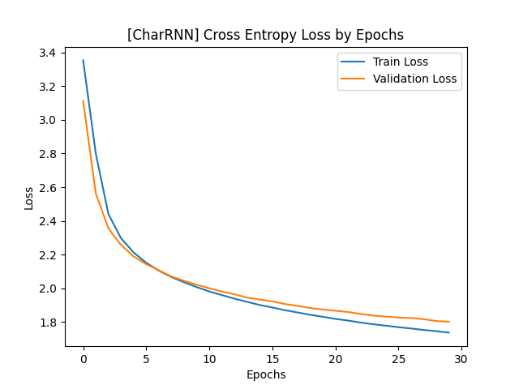

- CharLSTM  

한편, epoch 50을 기준으로 하였을 때 CharRNN과 CharLSTM의 validation loss 값은 각각 다음과 같다. (소수점 아래 다섯번쨰 자리에서 반올림; Cross Entropy Loss(CEL) 기준)
||CharRNN|CharLSTM|
|:--|--:|--:|
|CEL(Train)|1.6397|1.5935|
|CEL(Valid)|1.7249|1.6805|

### 2. Choose the model showing the best validation performance. You should provide at least 100 length of 5 different samples generated from different seed characters.
학습된 모델을 사용하여 character generation을 수행하였다. Epoch 50을 기준으로 CharLSTM의 validation loss가 CharRNN보다 낮으므로 CharLSTM을 사용하였다. 학습된 CharLSTM으로 5개의 seed character에 대한 sample을 생성한 결과는 다음과 같다. 이때, temperature는 0.8을 사용하였으며 주어진 seed character 다음으로 총 100개의 문자를 생성하도록 지정하였다.  

- Seed character: 'A'  
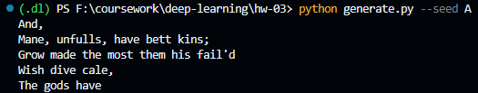

- Seed character: 'B'
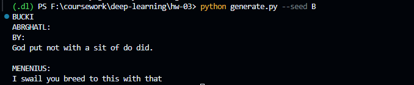

- Seed character: 'C'
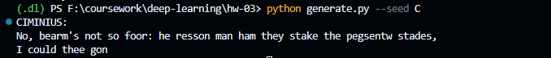

- Seed character: 'D'
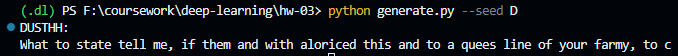

- Seed character: 'E'
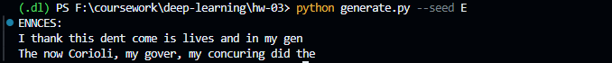

### 3. Try different temperature when you generate characters, and discuss what difference the temperature makes and why it helps to generate more plausible results.
Temperature parameter $T$의 값을 변화시키면서 character generation 성능이 어떻게 변화하는지 정성적으로 살펴보았다.

- Temperature: 0.2
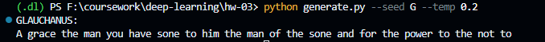

- Temperature: 0.5
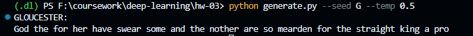

- Temperature: 0.8
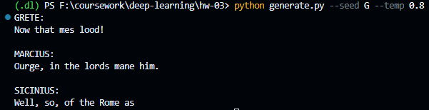

- Temperature: 1.0
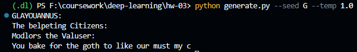

- Temperature: 2.0
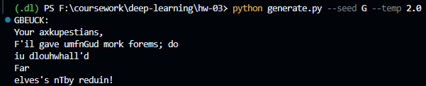

- Temperature: 10.0
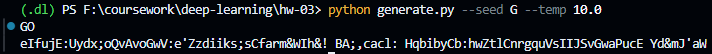

Temperature 값이 작은 경우에는 대체로 실제로 존재하는 영어 단어들이 잘 생성되는 것을 확인할 수 있었다. 반면에, temperature 값이 점점 커지는 경우에는 실제로 존재하지 않는 영어 단어들이 생성되며 temperature 값이 2.0을 넘어가면서부터는 다음 단어를 랜덤으로 생성하는 경향을 보이는 것을 확인할 수 있었다.

한편, softmax function with a temperature parameter $T$는 다음과 같이 정의된다.
$$y_i = \frac{\exp(z_i/T)}{\displaystyle\sum \exp(z_i/T)}$$

위 수식으로부터 $T$ 값에 따른 3가지의 시나리오를 생각해볼 수 있다.  
1. $T<1$: $T$가 1보다 작은 경우에는 원래 높은 값을 가지는 원소의 확률을 더욱 키우기 때문에 
2. $T=1$: 기존의 softmax와 동일하다.
3. $T>1$: $T$가 커지면 커질수록 문자별로 등장할 확률을 균등하게 만든다.

따라서, $T$의 값을 2.0 혹은 10.0으로 설정하였을 때 문자가 무작위로 생성되는 것처럼 보였던 이유는 모델이 vocabulary에 존재하는 문자들의 생성확률을 거의 균등하게 할당하였기 때문이다.