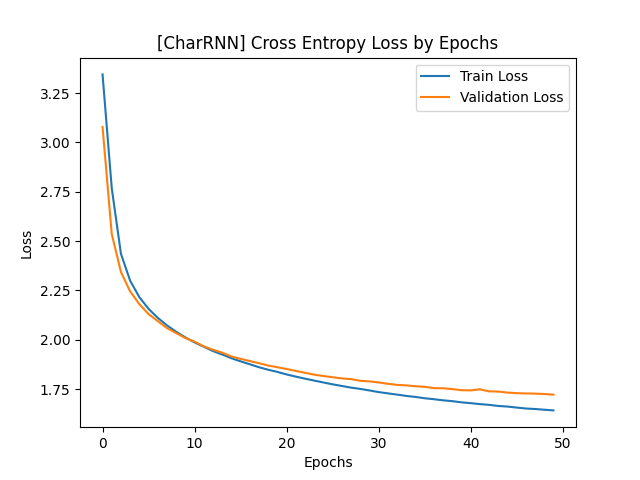
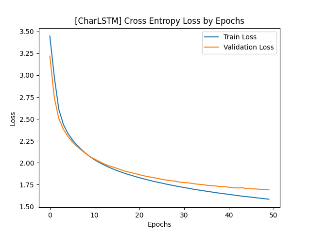

## 2024학년도 1학기 인공신경망과 딥러닝 HW#3

### 1. Plot the average loss values for training and validation. Compare the language generation performances of vanilla RNN and LSTM in terms of loss values for validatoin dataset.
CharRNN과 CharLSTM의 epoch별 cross entropy loss 변화 추이는 다음과 같다.

- CharRNN

- CharLSTM

한편, epoch 50을 기준으로 하였을 때 CharRNN과 CharLSTM의 validation loss 값은 각각 다음과 같다. (소수점 아래 다섯번쨰 자리에서 반올림; Cross Entropy Loss(CEL) 기준)
||CharRNN|CharLSTM|
|:--|--:|--:|
|CEL(Train)|1.6397|1.5935|
|CEL(Valid)|1.7249|1.6805|

### 2. Try different temperature when you generate characters, and discuss what difference the temperature makes and why it helps to generate more plausible results.

학습된 모델을 사용하여 character generation을 수행하였다. 이때, epoch 50을 기준으로 CharLSTM의 validation loss가 CharRNN보다 낮으므로 CharLSTM을 사용하였다. 또한, temperature parameter $T$의 값을 변화시키면서 character generation 성능이 어떻게 변화하는지 정성적으로 살펴보았다.

한편, softmax function with a temperature parameter $T$는 다음과 같이 정의된다.
$$y_i = \frac{\exp(z_i/T)}{\displaystyle\sum \exp(z_i/T)}$$

