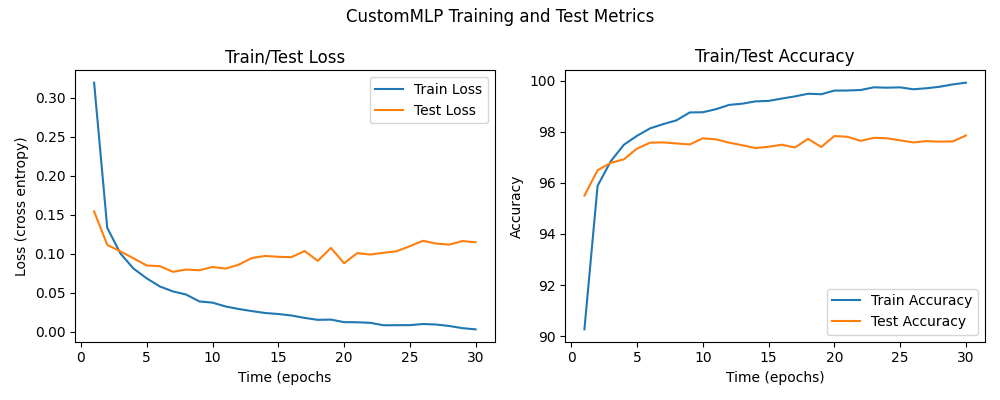

## 2024학년도 1학기 인공신경망과 딥러닝 HW#2

### 1. Describe the number of model parameters of LeNet-5 and your custom MLP and how to compute them.
LeNet-5와 CustomMLP의 파라미터 수는 각각 다음과 같다.
||LeNet-5|CustomMLP|
|:--|--:|--:|
#Params|61,706|61,568|

- LeNet-5  
1. Convolution Layer 1: $1 \times 6 \times (5 \times 5) + 6 = 156$
2. Convolution Layer 2: $6 \times 16 \times (5 \times 5) + 16 = 2416$
3. Fully Connected Layer 1: $(16 \times 5 \times 5) \times 120 + 120 = 48120$
4. Fully Connected Layer 2: $120 \times 84 + 84 = 10164$
5. Fully Connected Layer 3: $84 \times 10 + 10 = 850$

따라서, 총 파라미터의 수는 다음과 같다.
$$ 156 + 2416 + 48120 + 10164 + 850 = 61706$$

- CustomMLP
1. Fully Connected Layer 1: $(32 \times 32) \times 56 = 1024 \times 56 = 57344$
2. Fully Connected Layer 2: $56 \times 64 = 3584$
3. Fully Connected Layer 3: $64 \times 10 = 640$

따라서, 총 파라미터의 수는 다음과 같다.
$$57344 + 3584 + 640 = 61568$$

### 2. Plot average loss and accuracy for training and testing.
- LeNet-5  

- CustomMLP  

### 3. Compare the predictive performance of LeNet-5 and your custom MLP.
LeNet-5와 CustomMLP의 분류 성능은 각각 다음과 같다. (모두 최고 성능을 기준으로 작성되었다.)
||LeNet-5|CustomMLP|
|:--|--:|--:|
|ACC(%)|99.26|97.85|

### 4. Employ at least more than two regularization techniques to improve LeNet-5 model.
LeNet-5의 성능을 향상시키기 위하여 다음과 같은 정규화 기법들이 사용되었다.
- Dropout
- L2 regularization(Weight decay)

LeNet-5에 정규화 기법을 적용한 결과, 기존보다 오히려 성능이 소폭 감소하였다.

||LeNet-5|LeNet-5 with Reg.|
|:--|--:|--:|
|ACC(%)|99.26|98.20|

일반적으로 정규화 기법은 모델이 훈련 데이터에 과적합하는 것을 방지하여 모델의 일반화 성능을 저하시키지 않기 위해서 적용된다. 하지만, 정규화 기법을 적용하지 않은 LeNet-5 모델의 성능이 이미 주어진 데이터의 특성을 잘 포착하고 있고 과적합의 징후가 보이지 않았으므로 정규화 기법이 성능 향상에 크게 도움이 되지 않았다. 사실, 정규화 기법은 모델의 예측을 "일부러 틀리게" 만드는 계산이라는 점에서 성능이 소폭 감소한 것이 오히려 자연스러운 현상이라고 생각한다.