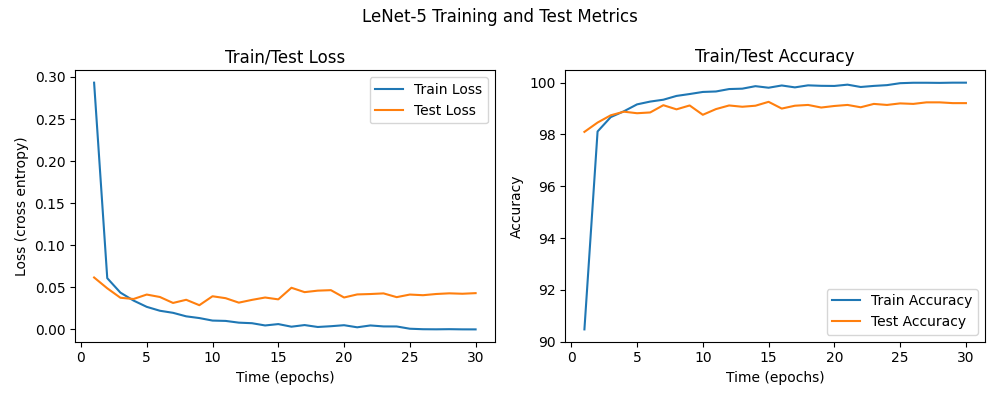

## 2024학년도 1학기 인공신경망과 딥러닝 HW#2

### 1. Describe the number of model parameters of LeNet-5 and your custom MLP.
LeNet-5와 CustomMLP의 파라미터 수는 각각 다음과 같다.
||LeNet-5|CustomMLP|
|:--|--:|--:|
#Params|61,706|61,698|

- LeNet-5  
1. Convolution Layer 1: 
2. Convolution Layer 2: 
3. Fully Connected Layer 1: 
4. Fully Connected Layer 2: 
5. Fully Connected Layer 3: 

따라서, 총 파라미터의 수는 다음과 같다.
$$1+2+3=5$$

- CustomMLP
1. Fully Connected Layer 1: (32 * 32) * 56 = 1024 * 56 = 57344
2. Fully Connected Layer 2: 56 * 64 = 3584
3. Fully Connected Layer 3: 64 * 10 = 640

따라서, 총 파라미터의 수는 다음과 같다.
$$57344 + 3584 + 640 = 61568$$

### 2. Plot average loss and accuracy for training and testing.
1. LeNet-5  

2. CustomMLP  

### 3. Compare the predictive performance of LeNet-5 and your custom MLP.
LeNet-5와 CustomMLP의 분류 성능은 각각 다음과 같다.
||LeNet-5|CustomMLP|
|:--|--:|--:|
|BCE|1|1|
|ACC|1|1|

한편, 이번 실험에서 측정된 LeNet-5의 Accuracy는 [ref]로, 기존 문헌에서 보고된 Accuracy인 [ref]와 유사하였다.

### 4. Employ at least more than two regularization techniques to improve LeNet-5 model.
LeNet-5의 성능을 향상시키기 위하여 다음과 같은 정규화 기법들이 사용되었다.
- regularization 1
- regularization 2

LeNet-5에 정규화 기법을 적용한 결과, 기존보다 더 높은 분류 성능을 보이는 것을 확인할 수 있었다.
||LeNet-5|LeNet-5 with Reg. 1| LeNet-5 with Reg. 2|
|:--|--:|--:|--:|
|BCE|1|1|1|
|ACC|1|1|1|

### Reference
- 